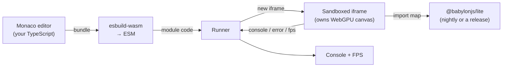

[API](https://doc.babylonjs.com/lite/typedoc/)

[Babylon Lite](https://doc.babylonjs.com/lite/)\|

[Playground](https://doc.babylonjs.com/lite/04-playground/)

…\|

[Babylon Lite](https://doc.babylonjs.com/lite/)\|

[Playground](https://doc.babylonjs.com/lite/04-playground/)

[Babylon.js](https://doc.babylonjs.com/) [Babylon Lite](https://doc.babylonjs.com/lite/)

Filter

Filter

- [Welcome](https://doc.babylonjs.com/lite/)

- [Getting Started](https://doc.babylonjs.com/lite/01-getting-started/)

- [Feature Comparison](https://doc.babylonjs.com/lite/02-feature-comparison/)

- [Porting Guide](https://doc.babylonjs.com/lite/03-porting-guide/)

- [Playground](https://doc.babylonjs.com/lite/04-playground/)

- [Headless Null Engine](https://doc.babylonjs.com/lite/05-headless-null-engine/)

- [Architecture](https://doc.babylonjs.com/lite/architecture/00-overview/)


# The Babylon Lite Playground

### Table Of Contents

[The Babylon Lite Playground](https://doc.babylonjs.com/lite/04-playground/#the-babylon-lite-playground) [Requirements](https://doc.babylonjs.com/lite/04-playground/#requirements) [Why use it?](https://doc.babylonjs.com/lite/04-playground/#why-use-it) [How to use it](https://doc.babylonjs.com/lite/04-playground/#how-to-use-it) [Write and run](https://doc.babylonjs.com/lite/04-playground/#write-and-run) [Examples](https://doc.babylonjs.com/lite/04-playground/#examples) [Multiple files](https://doc.babylonjs.com/lite/04-playground/#multiple-files) [Importing npm packages](https://doc.babylonjs.com/lite/04-playground/#importing-npm-packages) [Choosing the engine version](https://doc.babylonjs.com/lite/04-playground/#choosing-the-engine-version) [Saving, sharing & downloading](https://doc.babylonjs.com/lite/04-playground/#saving-sharing--downloading) [How it works](https://doc.babylonjs.com/lite/04-playground/#how-it-works) [Embedding](https://doc.babylonjs.com/lite/04-playground/#embedding) [1\. Drop in the iframe](https://doc.babylonjs.com/lite/04-playground/#1-drop-in-the-iframe) [2\. Talk to it over `postMessage`](https://doc.babylonjs.com/lite/04-playground/#2-talk-to-it-over-postmessage) [3\. A complete host example](https://doc.babylonjs.com/lite/04-playground/#3-a-complete-host-example) [Multi-file projects](https://doc.babylonjs.com/lite/04-playground/#multi-file-projects) [Next steps](https://doc.babylonjs.com/lite/04-playground/#next-steps)

The **[Lite Playground](https://liteplayground.babylonjs.com/)** is the fastest way to try Babylon Lite. Write TypeScript with full IntelliSense, run it live on a WebGPU canvas, and save & share the result as a link — all in the browser, with **nothing to install**.

> 🌐 **Open it now: [liteplayground.babylonjs.com](https://liteplayground.babylonjs.com/)**

> **Beta.** The Lite Playground is in beta — expect a few rough edges and occasional breaking changes while the experience stabilizes.

> New to Lite? Read **[Welcome](https://doc.babylonjs.com/lite)** for the big picture and **[Getting Started](https://doc.babylonjs.com/lite/01-getting-started)** for the mental model. The Playground is where you put that mental model to work without setting up a project.

* * *

## Requirements

- A **WebGPU-capable browser** — Chrome/Edge 113+, and recent Firefox and Safari. Babylon Lite is WebGPU-only, so the Playground is too.
- That's it. No Node, no bundler, no `npm install` — the editor, compiler, and engine all run in your browser.

* * *

## Why use it?

- **Zero setup.** Skip the install-and-configure step and start writing scene code immediately.
- **Learn by doing.** Load a built-in example, tweak it, and hit **Run** to see the result — the tightest possible feedback loop for learning the API.
- **Full IntelliSense.** The editor is wired with Babylon Lite's real type definitions, so autocomplete, hover docs, and inline errors all work against the actual engine API.
- **Share instantly.** Save a snippet and get a permalink you can drop into an issue, a forum post, or a bug report — the same snippet store the classic Babylon Playground uses.

* * *

## How to use it

### Write and run

The Playground opens on a starter scene. Edit the TypeScript in the left pane and press **Run** (the ▶ button, or **Ctrl/Cmd + Enter**) to execute it on the WebGPU canvas on the right. Every run starts from a clean slate, so you never have to reload the page.

Your code imports from the bare `@babylonjs/lite` specifier and grabs the canvas by id — exactly like a real app:

```typescript
import { createEngine, createSceneContext, /* … */ } from "@babylonjs/lite";

async function main() {
    const canvas = document.getElementById("renderCanvas") as HTMLCanvasElement;
    const engine = await createEngine(canvas);
    const scene = createSceneContext(engine);
    // … build your scene, then register and start …
}

main().catch((err) => console.error(err));
```

Anything you `console.log` shows up in the **Console** panel, and a live **FPS** readout and a **fullscreen** toggle sit in the top-right corner of the preview.

### Examples

The **Examples** dropdown in the toolbar seeds ready-made scenes — from a minimal starter to PBR, physics, and multi-file projects. Pick one as a starting point and modify it. Running an example is the quickest way to see a feature working end to end.

### Multiple files

Projects can span several files, just like the classic Playground's multi-file snippets. The tab bar above the editor lets you **add** (`+`), **rename** (double-click a tab), and **delete** (`×`) files, and the dot on each tab marks the **entry** file that the runner bundles from. Files import each other with relative specifiers:

```typescript
import { buildScene } from "./scene";
```

### Importing npm packages

Any bare import other than `@babylonjs/lite` is resolved from the [esm.sh](https://esm.sh/) CDN at run time, so external ESM packages work with no configuration:

```typescript
import seedrandom from "seedrandom"; // resolved from esm.sh automatically
```

`@babylonjs/lite` itself stays pinned to the engine version you select (see below).

### Choosing the engine version

The **Engine version** dropdown selects which build of Babylon Lite the runner loads:

- **Nightly (latest source)** — the newest engine built straight from the repository, so you can try changes before they're published.
- **A published release** — any version from npm, fetched on demand from esm.sh.

This lets you reproduce a bug against a specific release, or confirm a fix has landed in nightly.

### Saving, sharing & downloading

- **Save** (the floppy icon) stores your project and copies a permalink to the clipboard. Re-saving a loaded snippet creates a new revision of the same link. **Save with details…** (the caret) also captures a title, description, and tags.
- **Download** (the down-arrow) exports the whole project as a self-contained, runnable zip: an `index.html`, the bundled `main.js`, and any local assets it references. Serve the folder and it runs exactly as it did in the Playground.

Assets should be referenced by an absolute `https://` URL (e.g. `https://assets.babylonjs.com/…`) so they resolve the same way everywhere.

* * *

## How it works

The Playground never ships your code to a server to compile it. Everything happens client-side:

1. **You edit** TypeScript in a Monaco editor (the same editor that powers VS Code), typed against Babylon Lite's real `.d.ts` so IntelliSense matches the engine.
2. **The Playground transpiles** your files in the browser with `esbuild-wasm`, bundling from the entry file, inlining your relative imports, keeping `@babylonjs/lite` external, and rewriting any other bare import to an esm.sh URL.
3. **A sandboxed iframe runs the result.** The bundled module executes inside a fresh iframe that owns the WebGPU canvas, with an import map that resolves `@babylonjs/lite` to the engine version you selected. Because each run recreates the iframe, a broken scene can never corrupt the surrounding UI — just fix and run again.
4. **The iframe reports back** — console output, runtime errors, and FPS — over `postMessage`, which the shell shows in the console and the FPS readout.



The upshot: the Playground is a real, self-contained Babylon Lite app builder that compiles and runs entirely on your machine — the same code you write here runs unchanged in a project you scaffold with `npm install @babylonjs/lite`.

* * *

## Embedding

The Playground can be embedded in another page — docs, a blog, or the classic Babylon Playground — as an iframe, and driven over a small `postMessage` API to load code and run it. This is how live, editable Lite demos are hosted inside written content.

### 1\. Drop in the iframe

```html
<iframe src="https://liteplayground.babylonjs.com/?embed=runner" title="Babylon Lite Playground" style="width: 100%; height: 480px; border: 0"></iframe>
```

Pick an embed mode with `?embed=`:

- **`runner`** — canvas + console only, no editor. Best for docs and demos.
- **`split`** (also `?embed` or `?embed=1`) — a compact editor beside the canvas so readers can tweak the code themselves.

Optionally add `?embedOrigin=https://your-site.example` to restrict which origin the embed accepts messages from and posts events to (defaults to `*`). Set it to your own origin in production so only your page can drive the frame.

### 2\. Talk to it over `postMessage`

The host page and the embed communicate with `window.postMessage`. **Every message carries `channel: "babylon-lite-playground"`** — check it on both ends so messages don't collide with other frames on the page.

**Commands the host sends to the embed:**

| `type` | fields | effect |
| --- | --- | --- |
| `type`<br>`loadCode` | fields<br>`code`, `run?` | effect<br>replace the entry file's content; run it if `run` is true |
| `type`<br>`run` | fields<br>— | effect<br>run the current code |
| `type`<br>`dispose` | fields<br>— | effect<br>tear down the running scene |
| `type`<br>`getCode` | fields<br>— | effect<br>request the entry file's content (replies with a `code` event) |

**Events the embed sends back to the host:**

| `type` | fields | when |
| --- | --- | --- |
| `type`<br>`ready` | fields<br>`mode` | when<br>the embed is wired up and bootable |
| `type`<br>`console` | fields<br>`level`, `text` | when<br>a `console.*` line from the snippet |
| `type`<br>`error` | fields<br>`text` | when<br>an uncaught runtime error |
| `type`<br>`stats` | fields<br>`fps` | when<br>~once a second while running |
| `type`<br>`ran` | fields<br>— | when<br>a run finished importing |
| `type`<br>`code` | fields<br>`code` | when<br>reply to a `getCode` request |

> **Wait for `ready` before sending anything.** The embed can't accept commands until it has booted and emitted `ready`. Sending `loadCode` earlier is dropped.

### 3\. A complete host example

This loads your own code into the embed and runs it as soon as the frame is ready, then mirrors the snippet's console output and FPS onto the host page:

```html
<iframe id="pg" src="https://liteplayground.babylonjs.com/?embed=runner&embedOrigin=https://your-site.example"
        title="Babylon Lite Playground" style="width: 100%; height: 480px; border: 0"></iframe>

<script type="module">
    const frame = document.getElementById("pg");
    const channel = "babylon-lite-playground";

    const myCode = `import { createEngine, createSceneContext, createArcRotateCamera, attachControl,
    createHemisphericLight, createSphere, createPbrMaterial, addToScene,
    registerScene, startEngine } from "@babylonjs/lite";

async function main() {
    const canvas = document.getElementById("renderCanvas");
    const engine = await createEngine(canvas);
    const scene = createSceneContext(engine);

    const camera = createArcRotateCamera(-Math.PI / 2, Math.PI / 2.5, 4, { x: 0, y: 0, z: 0 });
    scene.camera = camera;
    attachControl(camera, canvas, scene);

    addToScene(scene, createHemisphericLight([0, 1, 0], 1.0));

    const sphere = createSphere(engine, { segments: 16, diameter: 2 });
    sphere.material = createPbrMaterial({ baseColorFactor: [0.9, 0.1, 0.1, 1], roughnessFactor: 0.4 });
    addToScene(scene, sphere);

    await registerScene(scene);
    await startEngine(engine);
}
main().catch((err) => console.error(err));`;

    // Send a command to the embed.
    function post(msg) {
        frame.contentWindow.postMessage({ channel, ...msg }, "*");
    }

    // Listen for events coming back from the embed.
    window.addEventListener("message", (e) => {
        if (e.data?.channel !== channel) return;
        switch (e.data.type) {
            case "ready":
                post({ type: "loadCode", code: myCode, run: true });
                break;
            case "console":
                console.log(`[playground:${e.data.level}]`, e.data.text);
                break;
            case "error":
                console.error("[playground error]", e.data.text);
                break;
            case "stats":
                // e.data.fps — e.g. update an on-page FPS badge
                break;
        }
    });
</script>
```

To re-run after editing, send `{ type: "run" }`; to stop the scene, send `{ type: "dispose" }`; to read back what the user typed in `split` mode, send `{ type: "getCode" }` and handle the `code` reply.

### Multi-file projects

`loadCode`/`getCode` are **single-file** — they only touch the entry file. To hand a full multi-file project to the standalone Playground, use the embed's **Open in Lite Playground** button, which carries every file via a deep link:

- `/snippet/<id>/v/<rev>` — a saved snippet (the canonical permalink).
- `#code=<base64url>` — an inline project (base64url of the project JSON), used when nothing is saved yet.

* * *

## Next steps

- 🚀 **[Getting Started](https://doc.babylonjs.com/lite/01-getting-started)** — the mental model behind the code you'll write in the Playground.
- 🔁 **[Porting Guide](https://doc.babylonjs.com/lite/03-porting-guide)** — translate a Babylon.js scene to Lite, then paste it in and run.
- 📊 **[Feature Comparison](https://doc.babylonjs.com/lite/02-feature-comparison)** — what Lite covers today, so you know what will run.
- 🌐 **[github.com/BabylonJS/Babylon-Lite](https://github.com/BabylonJS/Babylon-Lite)** — the source, including the Playground itself under `playground/`.

Built something worth sharing, or hit a rough edge? Save a snippet and **[open an issue](https://github.com/BabylonJS/Babylon-Lite/issues)** — early feedback directly shapes the roadmap. 💙

[](https://doc.babylonjs.com/lite/)

[Babylon.js](https://doc.babylonjs.com/) [Babylon Lite](https://doc.babylonjs.com/lite/)

Filter

Filter

- [Welcome](https://doc.babylonjs.com/lite/)

- [Getting Started](https://doc.babylonjs.com/lite/01-getting-started/)

- [Feature Comparison](https://doc.babylonjs.com/lite/02-feature-comparison/)

- [Porting Guide](https://doc.babylonjs.com/lite/03-porting-guide/)

- [Playground](https://doc.babylonjs.com/lite/04-playground/)

- [Headless Null Engine](https://doc.babylonjs.com/lite/05-headless-null-engine/)

- [Architecture](https://doc.babylonjs.com/lite/architecture/00-overview/)